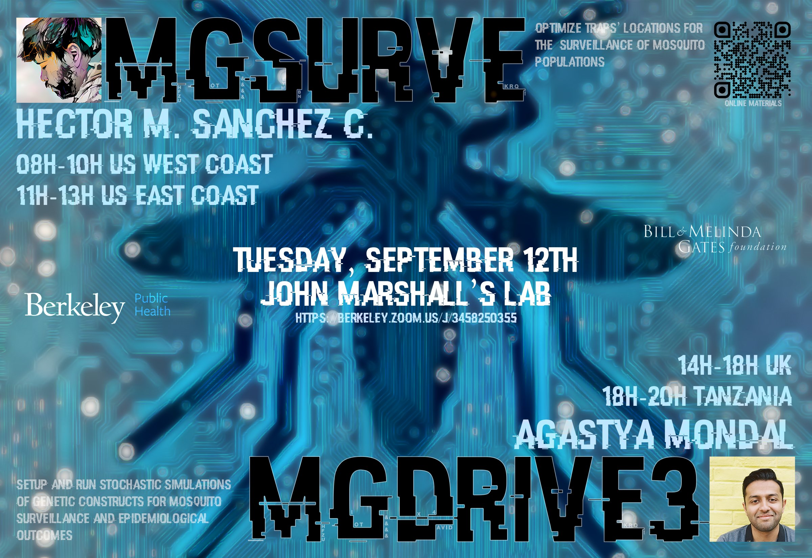

[](https://badge.fury.io/py/MGSurvE)
[](https://hub.docker.com/r/chipdelmal/mgsurve_webinar2023)
[](https://jupyterlab.readthedocs.io/en/latest/#)
[](https://www.gnu.org/licenses/gpl-3.0)
[](https://github.com/Chipdelmal/MGSurvE)
[](https://chipdelmal.github.io/MGSurvE/)
[](https://doi.org/10.5281/zenodo.8140947)


Our publication is in review, but you can have a look at our [preprint](https://www.biorxiv.org/content/10.1101/2023.06.26.546301v1) in the meantime!

## Contents

0. [Intro to Python (for R programmers)](./demos/fundamentals/python.ipynb)
1. Fundamentals
   1. [Quickstart](./demos/fundamentals/quickstart.ipynb)
   2. [Workflow Breakdown](./demos/fundamentals/breakdown.ipynb)
2. Landscape
   1. [Basic Landscape Elements](./demos/landscape/simpleLandscape.ipynb)
   2. [Heterogeneous Point-Types](./demos/landscape/complexLandscape.ipynb)
   3. [Custom Migration Matrix](./demos/landscape/customLandscape.ipynb)
3. Optimization
   1. [Genetic Algorithm Primer](./demos/optimization/ga.ipynb)
   2. [Discrete Optimization (GA)](./demos/optimization/discrete.ipynb)
   3. [Continuous Optimization (GA)](./demos/optimization/continuous.ipynb)
4. Analysis
   1. [Visualization Tools](./demos/analysis/visualization.ipynb)
   2. [GA Comparison](./demos/analysis/comparison.ipynb)
5. Advanced Topics
   1. [Mathematical Formulation](./demos/more/math.ipynb)
   2. [OpenStreetMap Compatibility](./demos/more/osm.ipynb)
   3. [Particle-Swarm Optimization (PSO)](./demos/more/pso.ipynb)
6. Preprint's Demos
   1. [Preprint on bioRxiv](https://www.biorxiv.org/content/10.1101/2023.06.26.546301v1)
   2. [São Tomé](./demos/paper/STP.ipynb)
   3. [Yorkeys Knob](./demos/paper/YKN.ipynb)

## Installation Instructions

The materials for this webinar can be run by installing the [codebase locally](./InstallationLocal.md), or by using our [docker image](./Installation_Docker.md). The easiest way to get all the materials for the webinar is to install [Docker](https://docs.docker.com/engine/install/) and download our [container](https://hub.docker.com/r/chipdelmal/mgsurve_webinar2023) with the following command in our terminal:

```bash
docker pull chipdelmal/mgsurve_webinar2023
```

Once the image is downloaded, we can run the contents with:

```bash
docker run -p 8888:8888 chipdelmal/mgsurve_webinar2023
```

and head to the following address in our internet browser: [http://127.0.0.1:8888/lab](http://127.0.0.1:8888/lab); where a [JupyterLab](https://jupyterlab.readthedocs.io/en/latest/) session should be running with all the required contents and packages for the course. To open up the webinar's index, open the [README.md file in the jupyterlab session](http://127.0.0.1:8888/lab/tree/README.md), right click anywhere in the document, and select `Show Markdown Preview`.

The changes we make within the Docker container won't be saved across sessions. If we want to make take notes on the notebooks and make changes session-persistent, first run:

```bash
docker volume create mgsurve
```

to create a docker volume. We can then launch the image with the volume attached with the following command:

```bash
docker run \
   -v mgsurve:/MGSurvE_Webinar2023 \
   -p 8888:8888 chipdelmal/mgsurve_webinar2023 
```


Additional instructions for [local installation](./InstallationLocal.md) are provided, as well as a more thorough set of alternatives in our [package documentation](https://chipdelmal.github.io/MGSurvE/build/html/installation.html) in case the [Docker](https://docs.docker.com/engine/install/) alternative is not suitable for any attendee!

## Video Recording

To watch the recording of the webinar session click on our banner!

<a href="https://youtu.be/RhYmeJ3XZ_8"></a>

## Authors and Funders

Dev and Webinar: [Héctor M. Sánchez C.](https://chipdelmal.github.io/blog/)

 

PIs: [John M. Marshall](https://publichealth.berkeley.edu/people/john-marshall/), [David L. Smith](http://www.healthdata.org/about/david-smith)

 &nbsp;  &nbsp; 

### Special Thanks

* [Tomás León](https://tomasleon.com/) for allowing us the use of his São Tomé migration matrix, and for advice in the ecology of the application.
* [Jared B Bennett](https://www.linkedin.com/in/jared-bennett-21a7a9a0) for tips and tricks on software and math for the optimization process.
* Lillian Weng, Xingli Yu, Ayden Salazar, Topiltzin Hernández Mares, and Joanna Yoo, for their help in developing the PSO algorithm.
* Elijah Bartolome for several benchmarks on the speed and accuracy of different spherical distance functions.
