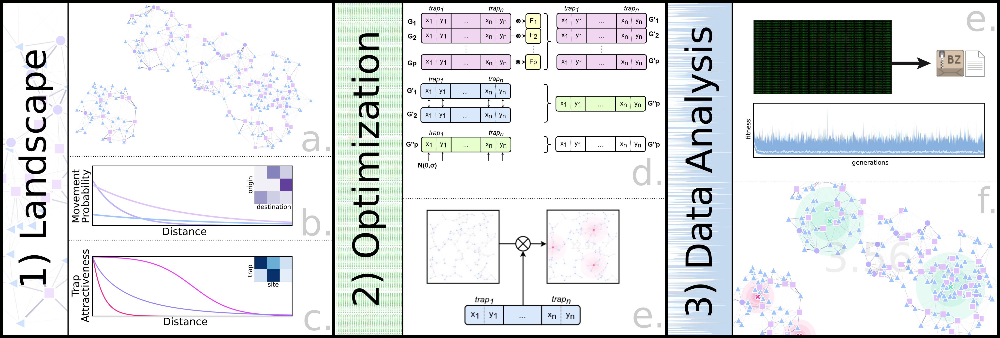

# Fundamentals

In this module of the webinar we will go through some of the basics on MGSurvE, namely what problems it tries to solve, how it is structured, and a quick example on an optimization workflow.

As a bonus, we have added a brief [intro to the Python programming language](./python.ipynb) which aims to help [R](https://www.r-project.org/) programmers follow along the materials of the course. It's worth noting, however, that this intro won't be covered in the session and is provided just as reference material.