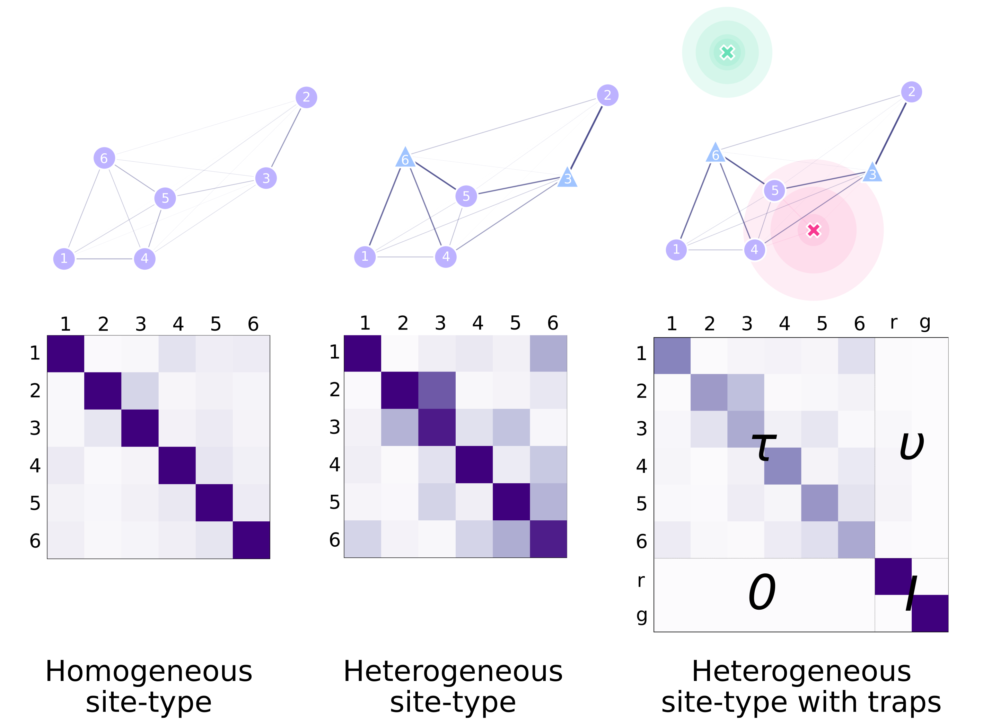

# Landscape

This section will go through setting up our landscape object to characterize the geography we want to lay our traps upon. In doing so, we will explain some of the assumptions, flexibilities, and limitations in the way we characterize mosquito movement in our software. We will also run a [realistic example in the geography of São Tomé](./customLandscape.ipynb).

